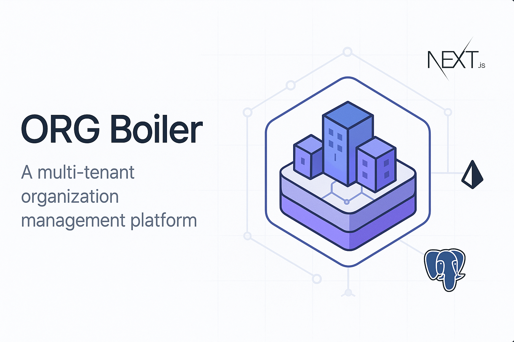

# ORG Boiler

<p align="center">
   
</p>
 
A modern, open-source multi-tenant organization management platform built with Next.js, Prisma, and PostgreSQL.

## Features

- **Multi-tenant Architecture**: Support for multiple organizations with isolated data
- **Subdomain Routing**: Access organizations via custom subdomains (e.g., `orgname.yourdomain.com`)
- **User Management**: Invite users, manage roles and permissions
- **Authentication**: Email/password authentication with NextAuth.js
- **Modern UI**: Clean, responsive interface built with Tailwind CSS
- **API-First Design**: RESTful API endpoints for all functionality

## Getting Started

First, run the development server:

```bash
pnpm dev
```

Open [http://localhost:3000](http://localhost:3000) with your browser to see the result.

You can start editing the page by modifying `app/page.tsx`. The page auto-updates as you edit the file.

This project uses [`next/font`](https://nextjs.org/docs/app/building-your-application/optimizing/fonts) to automatically optimize and load [Geist](https://vercel.com/font), a new font family for Vercel.
